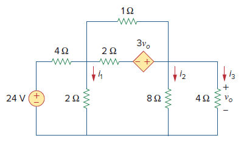

# Ejemplos

A continuación se muestran algunos en los que se hace uso de spice para la simulación de circuitos.

## Enunciados

### Ejemplo 1

Para el circuito mostrado en la siguiente figura, determine las corrientes i1, i2 e i3.

La simulación del circuito se encuentra en el siguiente [link](ejemplo1)

