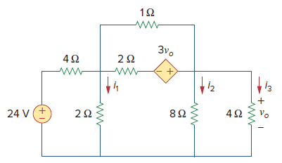

# Ejemplo 1

## Enunciado

Para el circuito mostrado en la siguiente figura, determine las corrientes i1, i2 e i3.



La simulación del circuito se encuentra en el siguiente [link](ejemplo1)


## Simulación

Para obtener los resultados solicitados la simulación que se lleva a cabo es la simulación **OP** (**Operation Point**).

### Esquematico

La siguiente figura muestra el esquematico obtenido en LTspice


* **Archivo**: [circuito1.asc](circuito1.asc)


### Archivo de texto

Para crear el archivo de texto es necesario enumerar el circuito de interes, tal y como se muestra en la siguiente figura:


En el archivo [circuito1.cir](circuito1.cir) que describe el circuito anterior se muestra a continuación:

```
Circuito ejemplo

** Circuit Description **

Vs 1 0 DC 24V
R1 1 2 4
R2 2 0 2
R3 4 0 8
R4 4 0 4
R5 2 3 2
R6 2 4 1
E1 4 3 4 0 3

** Analysis Requests **
.OP
.end
```

### Resultados de la simulación

A continuación se muestra la simulación del circuito en LTspice:


Los resultados se muestran a continuación:

```
       --- Operating Point ---

V(1):	 24	 voltage
V(2):	 2.66667	 voltage
V(4):	 10.6667	 voltage
V(3):	 -21.3333	 voltage
I(R6):	 -8	 device_current
I(R5):	 12	 device_current
I(R4):	 2.66667	 device_current
I(R3):	 1.33333	 device_current
I(R2):	 1.33333	 device_current
I(R1):	 5.33333	 device_current
I(E1):	 -12	 device_current
I(Vs):	 -5.33333	 device_current
```

A continuación se muestran los resultados de la simulación:
1. **Corriente I1**: ```I1 = I(R2) = 1.33333 A```
2. **Corriente I2**: ```I1 = I(R3) = 1.33333 A```
3. **Corriente I4**: ```I1 = I(R4) = 2.66667 A```
